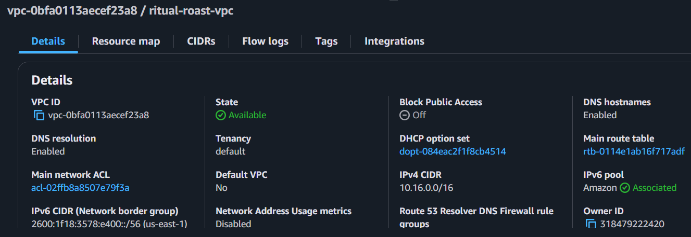
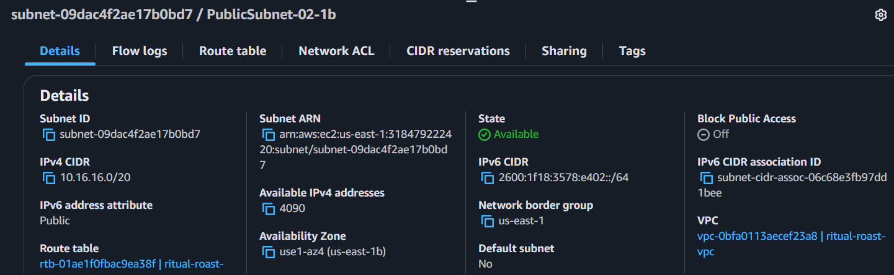
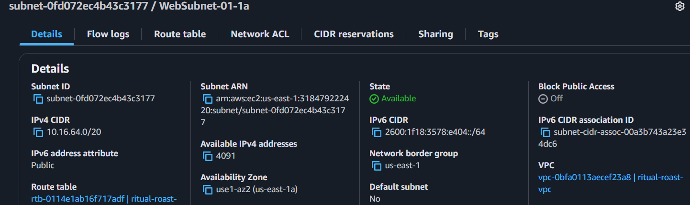
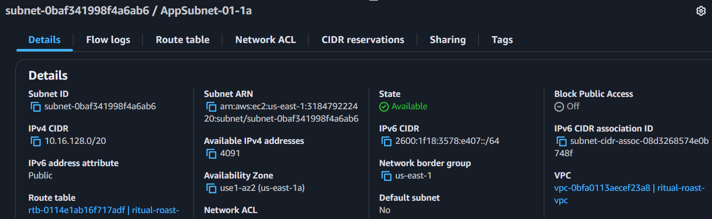
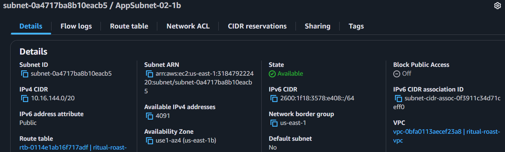
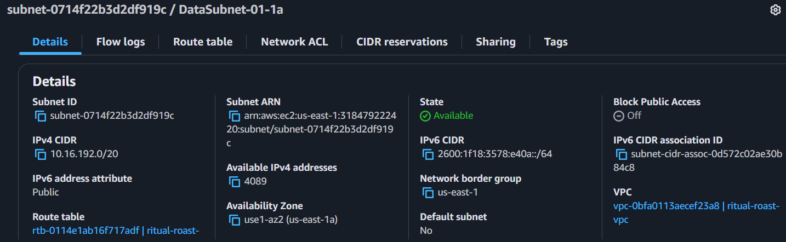
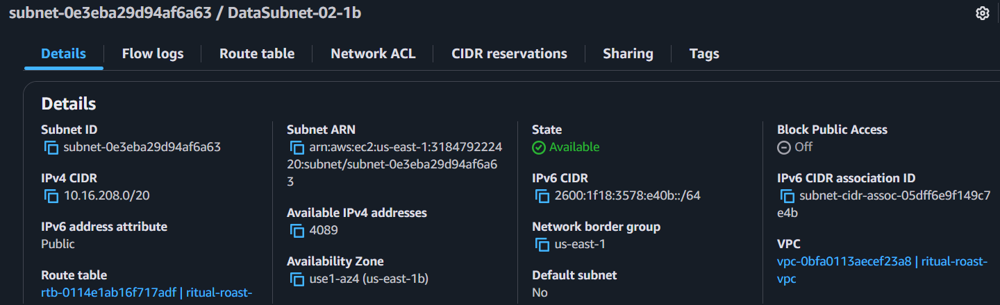

# Ritual Roast Three Tier Web Application

Deployed a highly available 3-tier web application on Amazon Web Services using EC2, ALB and RDS with Multi-AZ support.

## Overview:
To design a secure, scalable and fault-tolerant 3-tier architecture on AWS for hosting a Ritual Roast Customer Contest web application (MVP). The application will use:
- Application Load Balancer (ALB) for routing traffic
- Amazon EC2 instances for compute 
- RDS for database tier

## Customer Flow Chart
- Customer (Web Browser)
	- Initiates access to the web via public internet
- Application Load Balancer
	- Receives all incoming traffic.
	- Distributes requests across a fleet of EC2 instances.
- EC2 instances (App + Web Tier Combined)
- Host both the Frontend (form and recipe table display) and the Backend (code to handle form submissions and DB queries)
	- Display a form to the user and render the table of submitted recipes. 
- Amazon RDS (MySQL, Multi-AZ)
	- Stores submitted recipe data.
	- Backend reads from this DB to populate the frontend dynamically.

## Low Level Design Architecture

# Low Level Design Documentation

## VPC Configuration

| Component                     | Details                                                                 |
|-----------------------------|-------------------------------------------------------------------------|
| VPC CIDR                    | 10.16.0.0/16                                                            |
| Internet Gateway            | Attached to VPC                                                         |
| NAT Gateway                 | 1 NAT Gateway in Public Subnet 1 (10.16.0.0/20)                         |
| Public Subnets              | 10.16.0.0/20 (us-east-1a), 10.16.16.0/20 (us-east-1b)                  |
| Web Subnets (Private)       | 10.16.64.0/20 (us-east-1a), 10.16.80.0/20 (us-east-1b)                 |
| App Subnets (Private)       | 10.16.128.0/20 (us-east-1a), 10.16.144.0/20 (us-east-1b)               |
| Data Subnets (Private)      | 10.16.192.0/20 (us-east-1a), 10.16.208.0/20 (us-east-1b)               |
| Public Route Table          | 0.0.0.0/0 → Internet Gateway                                            |
| Private Route Table (Main)  | 0.0.0.0/0 → NAT Gateway                                                 |

| Security Group     | Inbound Rules                                                                 |
|------------------|------------------------------------------------------------------------------|
| LoadBalancer-SG  | Allow HTTP (port 80) from 0.0.0.0/0                                          |
| Web-App-SG       | Allow TCP 5000 from load-balancer-sg                                          |
| Database-SG      | Allow TCP 3306 from web-app-sg and from itself (for Secrets Manager rotation) |

## RDS MySQL Configuration

| Component        | Details                                                                 |
|-----------------|-------------------------------------------------------------------------|
| Engine          | MySQL                                                                  |
| Deployment      | Multi-AZ (us-east-1a and us-east-1b)                                   |
| Subnet Group    | Data subnets (10.16.192.0/20, 10.16.208.0/20)                          |
| Storage Type    | General Purpose SSD – 20GB                                             |
| Secrets Manager | Stores RDS Credentials                                                 |
| Rotation        | Enabled, every 7 days                                                  |

## S3 Bucket Configuration

| Component          | Details                                      |
|--------------------|----------------------------------------------|
| Purpose            | Hosting Flask application source code        |
| Bucket Policy      | Only accessible via EC2 IAM Role             |
| Storage Class      | Standard                                     |
| Versioning         | Enabled                                      |
| Bucket Replication | N/A                                          |

## EC2 Instance Configuration

| Component         | Details                                                                 |
|------------------|-------------------------------------------------------------------------|
| AMI              | Amazon Linux 2023                                                      |
| Instance Profile | IAM Role with S3, SSM, Secrets Manager permissions                     |
| Permissions      | AmazonS3FullAccess, AmazonSSMManagedInstanceCore, SecretsManagerReadWrite |

## IAM Role for EC2

| Permission                          | Purpose                         |
|------------------------------------|---------------------------------|
| AmazonS3FullAccess                 | Fetch application code          |
| AmazonSSMManagedInstanceCore       | SSM Session Manager access      |
| SecretsManagerReadWrite (GetSecretValue) | Fetch DB credentials securely   |

## Application Load Balancer Configuration

| Component       | Details                                                                 |
|----------------|-------------------------------------------------------------------------|
| Type           | Internet-facing                                                         |
| Subnets        | Public Subnets 1 & 2                                                    |
| Security Group | loadbalancer-sg                                                         |
| Target Group   | Targets on port 5000 (EC2s) – configured by ASG                         |
| Listener       | HTTP listener on port 80 → forwards to target group                     |
| Health Checks  | TCP/5000 or HTTP endpoint (e.g., /)                                     |

## Auto Scaling Group Configuration

| Component         | Details                                                                 |
|------------------|-------------------------------------------------------------------------|
| Launch Template  | Includes AMI, IAM Role, and User Data                                  |
| User Data Script | Install Python, Flask, download from S3, run app                       |
| Scaling Policy   | Target Tracking                                                         |
| Instance Count   | Min: 2, Desired: 2, Max: 4                                              |
| Subnets          | App Subnets (Private): 10.16.128.0/20, 10.16.144.0/20                  |

# Deployment Steps with Screenshots

## Step 1

The first step was to create a VPC which was named ritual-roast-vpc. So, a VPC is a logical partition of AWS infrastructure where we can deploy our resources and make sure, they are logically isolated from other customers that are also using the AWS infrastructure. The VPC was created in the region us-east-1 in N. Virginia. The VPC CIDR configured was 10.16.0.0/16. Below is a screenshot of the created VPC:

## Step 2
The VPC would comprise of multiple subnets. For the project, we will make use of eight subnets. Two subnets, each for Public, Web, Application, and Data across two Availability Zones (us-east-1a and us-east-1b). The architecture is based on the VPC CIDR block range 10.16.0.0/16. Below are the screenshots of the created subnets with the assigned VPC:

