# Ritual Roast Containerized Web Application

Deployed a containerized application on Amazon ECS using Fargate for serverless compute.

## Overview:
To design a secure, scalable architecture on AWS for hosting a Ritual Roast Customer Contest web application (MVP). The application will use:
- Application Load Balancer (ALB) for routing traffic
- Amazon ECS (using Fargate Launch Type)
- RDS for database tier

## Customer Flow Chart
- Customer (Web Browser)
	- Initiates access to the web appears via public internet
- Application Load Balancer
	- Receives all incoming traffic.
	- Distributes traffic using path-based rules - all traffic is routed to the frontend Next.js app and request to add or get recipes directed to the backend Flask app
- Amazon ECS
	- The Next.js frontend and Flask backend will each run as independent ECS services using Fargate tasks, allowing them to scale and deploy separately.
	- Display a form to the user and render the table of submitted recipes. 
- Amazon RDS (MySQL, Multi-AZ)
	- Stores submitted recipe data.
	- Backend reads from this DB to populate the frontend dynamically

## Low Level Design Architecture

# Low Level Design Documentation

## VPC Configuration

| Component | Details |
|----------|--------|
| VPC CIDR | 10.16.0.0/16 |
| Internet Gateway | Attached to VPC |
| NAT Gateway | 1 NAT Gateway in Public Subnet 1 (10.16.0.0/20) |
| Public Subnets | 10.16.0.0/20 (us-east-1a), 10.16.16.0/20 (us-east-1b) |
| WebApp Subnets (Private) | 10.16.64.0/20 (us-east-1a), 10.16.80.0/20 (us-east-1b) |
| Data Subnets (Private) | 10.16.192.0/20 (us-east-1a), 10.16.208.0/20 (us-east-1b) |
| Route Tables | Public: 0.0.0.0/0 → IGW   Private: 0.0.0.0/0 → NAT Gateway |

| Security Group | Inbound Rules |
|---------------|--------------|
| rr-load-balancer-sg | Allow HTTP (80) from 0.0.0.0/0 |
| rr-web-app-sg | Allow TCP 5000 from rr-load-balancer-sg   Allow TCP 3000 from rr-load-balancer-sg |
| rr-database-sg | Allow TCP 3306 from rr-web-app-sg and from itself (for Secrets Manager Lambda rotation) |

## RDS MySQL Configuration

| Component | Details |
|----------|--------|
| Engine | MySQL |
| Deployment | Multi-AZ (us-east-1a, us-east-1b) |
| Subnet Group | 10.16.192.0/20, 10.16.208.0/20 |
| Storage Type | General Purpose SSD (20GB) |
| Secrets Manager | Stores credentials |
| Rotation | Enabled (7 days) |

## IAM Role for ECS & EC2

### ECS Permissions

| Permission | Purpose |
|-----------|--------|
| AmazonECSTaskExecutionRolePolicy | Pull images from Amazon ECR & send logs to Amazon CloudWatch |
| SecretsManagerReadWrite | Fetch DB credentials securely |

### EC2 Permissions

| Permission | Purpose |
|-----------|--------|
| AmazonSSMManagedInstanceCore | SSM Session Manager access for Docker Image Server |

## EC2 Instance Configuration (Docker Server)

| Component | Details |
|----------|--------|
| AMI | Amazon Linux 2023 |
| Instance Profile | IAM Role for SSM |
| Permissions | AmazonSSMManagedInstanceCore |
| Apps | Docker |

## ECR Docker Images

| Component | Details |
|----------|--------|
| Purpose | Docker images for Next.js frontend UI & Flask backend application |

## ECS Task Definitions

### Next.js Frontend App

| Task Definiton | Details |
|------|------|
| Task Definition Name | ritual-roast-nextjs-frontend-task-def |
| IAM Role | Task execution role |
| Container Name | ritual-roast-nextjs-container |
| Port Mappings | 3000 |

### Flask App

| Task Defintion | Details |
|------|------|
| Task Definition Name | ritual-roast-flask-backend-task-def |
| IAM Role | Task execution role |
| Container Name | ritual-roast-flask-container |
| Port Mappings | 5000 |

## Load Balancer Target Groups

| Next.js App Target Group | Details |
|------|------|
| Name | ritual-roast-nextjs-tg |
| Target Type | IP |
| Port | 3000 |
| Protocol | HTTP |
| Health Check | / |

| Flask App Target Group | Details |
|------|------|
| Name | ritual-roast-flask-tg |
| Target Type | IP |
| Port | 5000 |
| Protocol | HTTP |
| Health Check | /api/health |

## Application Load Balancer Configuration

| Component | Details |
|----------|--------|
| Name | ritual-roast-alb |
| Type | Internet-facing |
| Subnets | Public Subnets 1 & 2 |
| Security Group | rr-load-balancer-sg |
| Listener | HTTP:80 → ritual-roast-nextjs-tg |
| Condition Rule | Path /api/* → ritual-roast-flask-tg |

## ECS Service - Next.js Frontend App

| Next.js App Service | Details |
|----------|--------|
| Task Definition | ritual-roast-nextjs-frontend-task-def |
| Revision | (Latest) |
| Service Name | ritual-roast-nextjs-frontend-service |
| Cluster Type | Fargate |
| Capacity Provider Strategy | Fargate |
| Service Type | REPLICA |
| Desired Tasks | 2 |
| VPC | ritual-roast-vpc |
| Security Group | rr-web-app-sg |
| Load Balancer Type | Application Load Balancer |
| Load Balancer Name | ritual-roast-alb |
| Listener Protocol | HTTP:80 |
| Target Group | ritual-roast-nextjs-tg |
| Health Check | / |
| Protocol | HTTP |

## ECS Service - Flask Backend App

| Flask App Service | Details |
|----------|--------|
| Task Definition | ritual-roast-flask-backend-task-def |
| Revision | (Latest) |
| Service Name | ritual-roast-flask-backend-service |
| Cluster Type | Fargate |
| Capacity Provider Strategy | Fargate |
| Service Type | REPLICA |
| Desired Tasks | 2 |
| VPC | ritual-roast-vpc |
| Security Group | rr-web-app-sg |
| Load Balancer Type | Application Load Balancer |
| Load Balancer Name | ritual-roast-alb |
| Listener Protocol | HTTP:80 |
| Target Group | ritual-roast-flask-tg |
| Health Check | /api/health |
| Protocol | HTTP |

# Deployment Steps with Screenshots

## Step 1

The first step was to create a VPC which was named ritual-roast-vpc. So, a VPC is a logical partition of AWS infrastructure where we can deploy our resources and make sure, they are logically isolated from other customers that are also using the AWS infrastructure. The VPC was created in the region us-east-1 in N. Virginia. The VPC CIDR configured was 10.16.0.0/16. Below is a screenshot of the created VPC:

## Step 2
The VPC would comprise of multiple subnets. For the project, we will make use of six subnets. Two subnets, each for Public, Web application, and Data across two Availability Zones (us-east-1a and us-east-1b). The architecture is based on the VPC CIDR block range 10.16.0.0/16. Below are the screenshots of the created subnets with the assigned VPC:

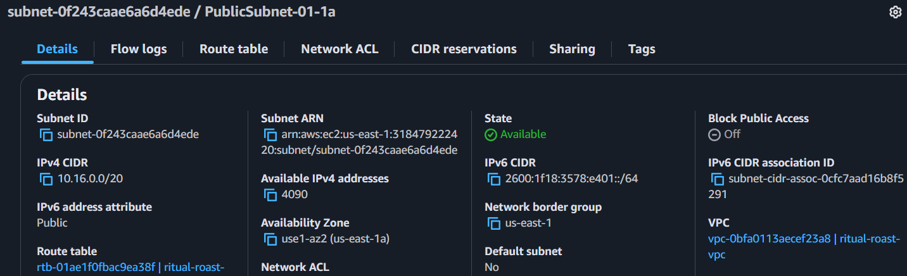

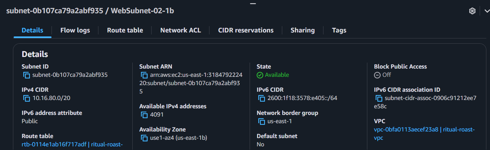

## Step 3

Once the subnets are created, we then create an Internet Gateway (IGW) by assigning a VPC for public internet access for public subnet, next we create a public route table which will have default route of VPC to route traffic locally/internally and create another route for internet access via Internet Gateway and finally associate public subnets to the public route table. Below are screenshots of the IGW and ritual roast public route table:

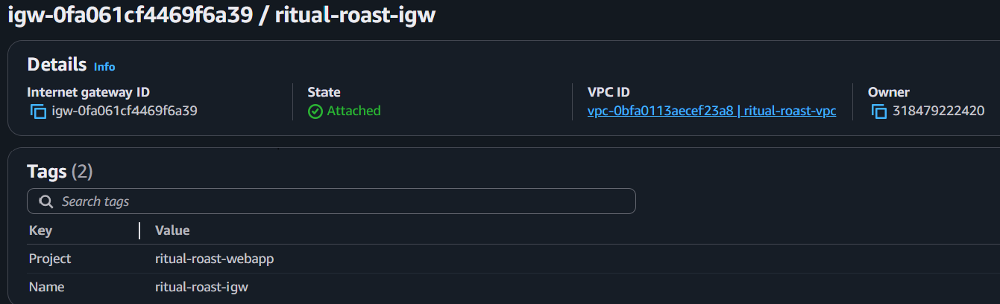

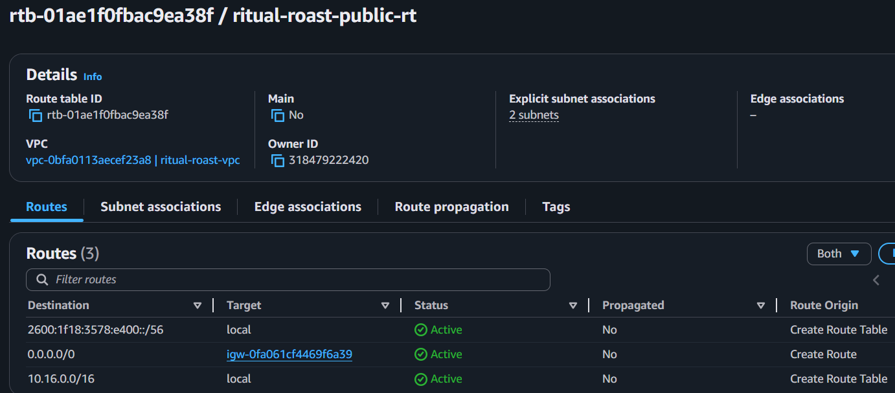

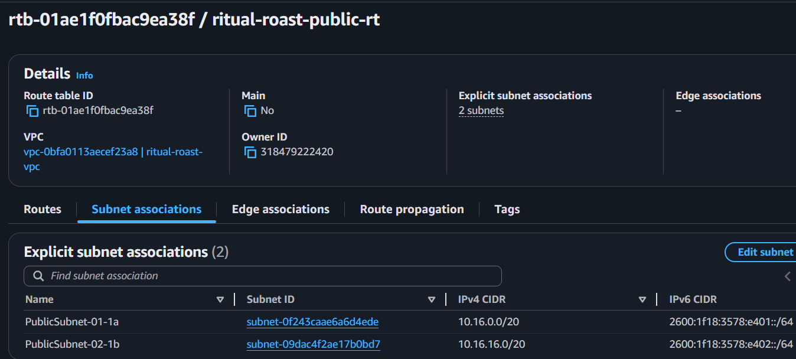

## Step 4

We use a Nat gateway when we need to access internet from a private subnet. So, a Nat Gateway would be created in Ritual Roast VPC and added to a public subnet. Although, it can be in Multiple Availability Zones but because it is a service for which we are charged so I have created just one in PublicSubnet-01-1a. The main route table is modified to add entry of Nat Gateway. Again, the request from Nat Gateway passes to IGW which then sends it to its destination. The request from resources in private subnet is intercepted by Nat Gateway which performs IP masquerading. It changes Private IP to Public IP and then sends it to IGW. Below are screenshots of NAT GW and the main route table created for Ritual Roast containerized web application deployment on the AWS:

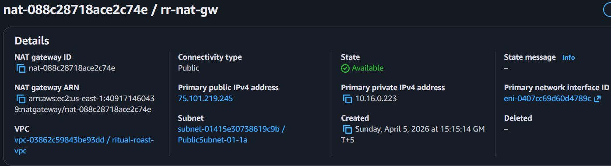

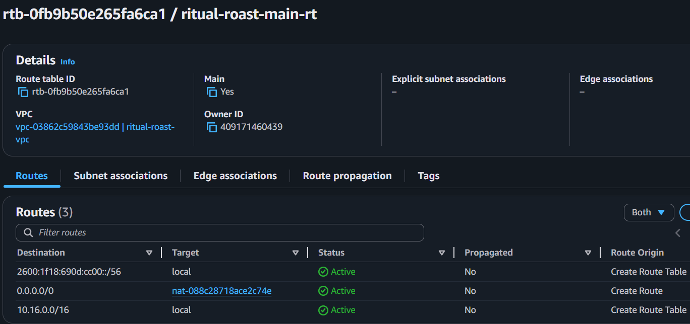

## Step 5

Three security groups were created for containerized application deployment. First security group had an inbound rule where it would allow HTTP traffic from internet to application load balancer. The second security group would allow traffic from application load balancer to web application servers on port 5000. The reason for allowing traffic on port 5000 is it is default port for Flask application and ritual roast project is built using Flask framework, which is a lightweight, web framework written in Python used to build web applications and APIs. Ritual Roast application is based on HTML, Python and Flask framework. For ritual roast containerized application project we will also be updating the security group for the web app security group to include the inbound port from the load balancer which is on port 3000 for Nextjs frontend application. Third security group would allow traffic from web application servers security group and its own security group (for Secrets Manager Lambda rotation) on port 3306 so that Lambda function that is going to be deployed by Secrets Manager service will be able to talk to the database and update the credentials. Below are screenshots of the security groups created along with their inbound rules:

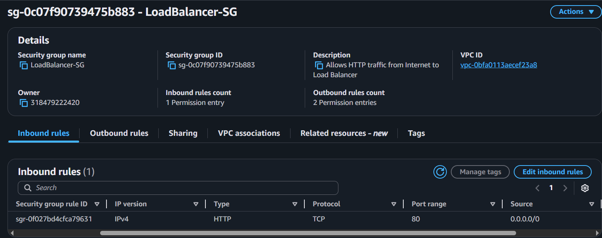

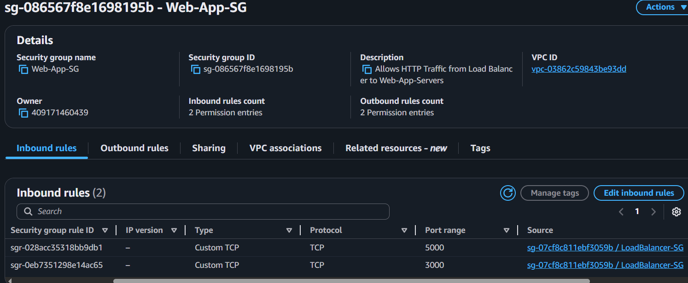

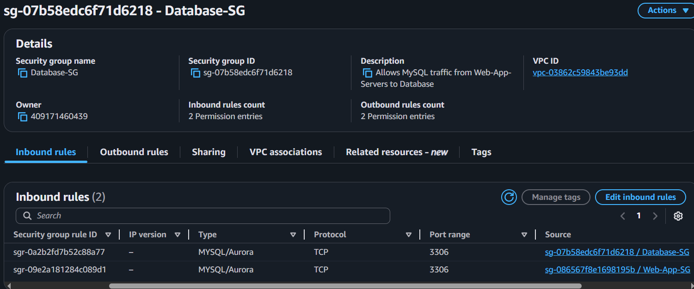

## Step 6

Relational Database Service (RDS) MySQL database is deployed as we will be using MySQL as the backend data store for customers submitting recipes, and we would use multi-AZ configuration. First, we create a subnet group for RDS where the two Data subnets (datasubnet-01-1a and datasubnet-02-1b) are associated with RDS then we create the RDS database where we provide all the required RDS instance configurations. The storage type for database used is General Purpose SSD with 20GB storage. Also, Secrets Manager will be used to store credentials in the next step. Below is the screenshot of the created RDS database for the Ritual Roast project:

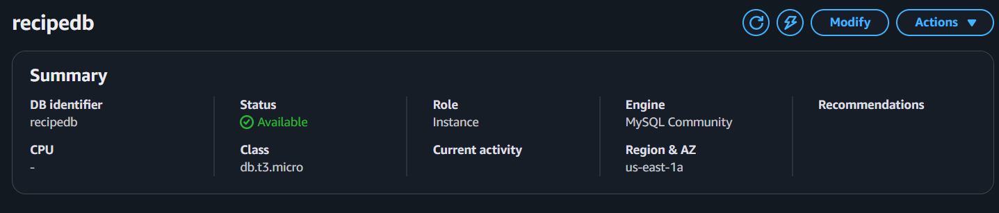

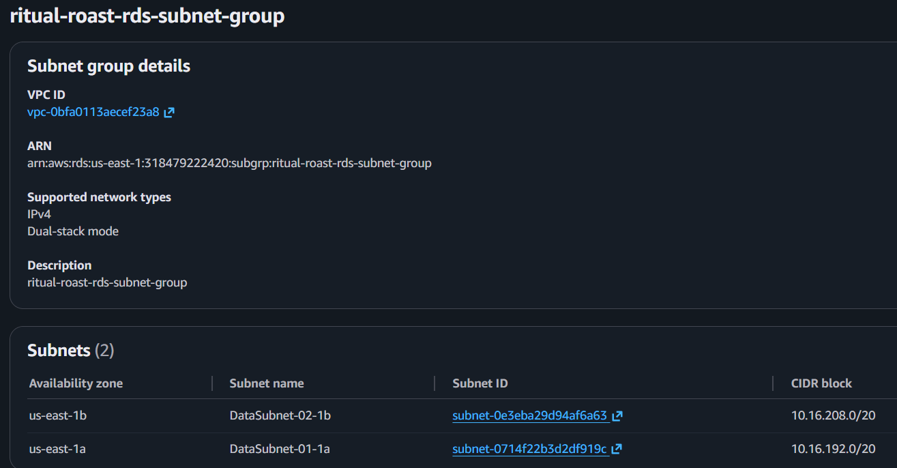

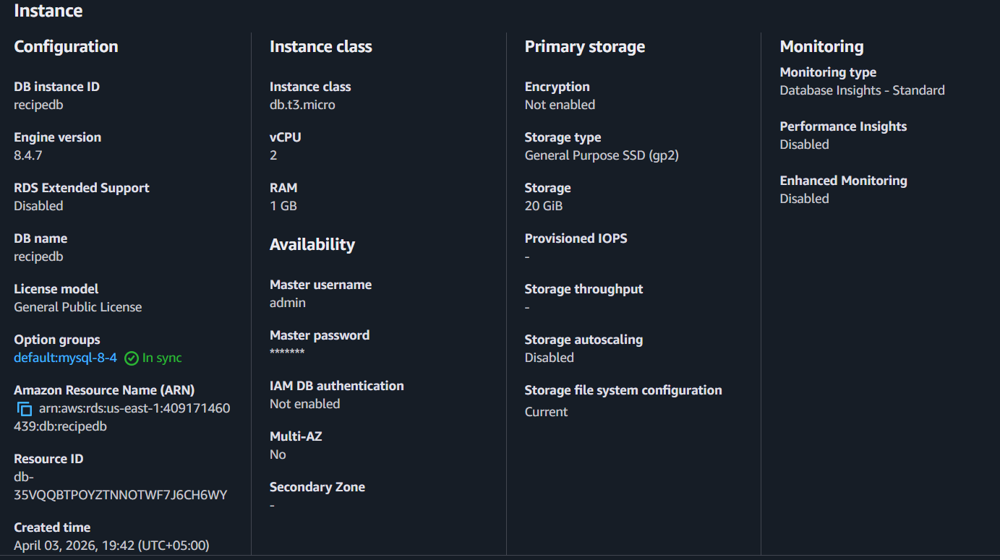

## Step 8

An additional security measure as part of the architecture is to make sure the app is not embedded with database credentials to access the backend database. Good practice is to ensure the app can dynamically retrieve the credentials to access database and for that purpose we have made use of AWS Secrets Manager. It allows us to encrypt and store database credentials which we would need to have the application retrieve dynamically by providing access to secrets manager. We also set up rotation feature on secrets manager that can rotate credentials regularly. Below is the screenshot for created secret:

## Step 9

Another critical element of architecture is IAM Role. A lot of the services are dependent on each other. The EC2 instances that we deploy in web/app subnet are going to need to be able to pull source code files from S3 bucket. They are going to need to get credentials from Secrets Manager dynamically. So, we will need IAM Roles for that because one resource accessing or connecting to another resource would need authentication/authorization that is where IAM Roles come into play. Below is the screenshot of the created EC2 IAM Role:

## Step 10

In addition, we deploy Application Load Balancer (ALB). The ALB will accept inbound traffic from the internet on port 80 from customers and distribute traffic to ALB nodes that are deployed in public subnets. As part of ALB, we will be configuring target groups as target groups would host or define the targets, which will be the EC2 instances that will run the web application. Before creating the ALB, we create the target group where we configure the protocol as HTTP, select port 5000 for Flask Web Application, select the VPC specifically created for the Ritual Roast Web Application project and lastly, we configure the health checks for the instances. Next, we deployed the load balancer where we made sure it is multi-AZ for our project, selected the Ritual Roast VPC, load balancer security group and the target group created for the ritual roast application along with port 80 to listen to traffic from internet. Below is screenshot showing the configurations used for ALB:

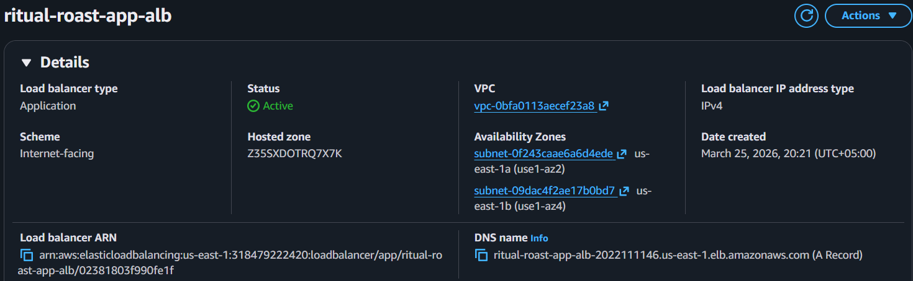

## Step 11

After having deployed ALB, next we will deploy an Auto Scaling Group (ASG) which will have a launch template design that will allow us to scale in and scale out EC2 instances. The launch template will be configured to use the AMI, which is a standard Linux 2023 AMI, it will also be configured with a User Data Script that will allow us to download source code files from S3 bucket to our EC2 instances once they are launched. In addition to that the launch template will be configured with the IAM roles necessary to give permissions so that it can access all those other resources that it needs to access with all configurations in place. The launch template will launch web application which will be fully configured to run the Flask based application. Below are screenshots of the configured ASG, launch template, the user data script code that we used during the launch of EC2 instances, and the instance summary once in available state:

# Ritual Roast Web Application High Availability Tests

Once the deployment is complete for multi-tier application using AWS services, next we run some high availability tests. First, we do a test to see if auto scaling group works as expected or not. The ASG was designed to ensure that there are always two instances available across the two subnets across the two availability zones. For the first test we stopped one of the two running instances and once stopped it would mean the health check would fail and the target group would show only one healthy instance remaining while there will be three total targets. It means that there is already one more instance in deployment. From the activity history in ASG we can see that one instance was drained as it was found to be out of service and immediately terminated upon health check failure. Subsequently, a new replacement instance was successfully launched in response to an unhealthy instance. The target group would show us two healthy instances, and we would still be able to access the application from the other active instance using the DNS name from the Load Balancer. Below are screenshots from the first test we did by stopping one running instance to check availability of the web application and the behavior of ASG running a fleet of two EC2 instances:

For RDS database failover we would go to the already created ritualroastdb. We performed a simulation of a failover by rebuilding the primary database instance. So, for that we select the Reboot with Failover? option to perform a failover. Once confirmed the database instance will be rebooted. The data will be replicated synchronously. Below screenshots show we can still connect to the database once the reboot has been completed as a third recipe has been added post failover:

### Ritual Roast Application Pre Failover

### Ritual Roast Application Post Failover

