# Ritual Roast Containerized Web Application

Deployed a containerized application on Amazon ECS using Fargate for serverless compute.

## Overview:
To design a secure, scalable architecture on AWS for hosting a Ritual Roast Customer Contest web application (MVP). The application will use:
- Application Load Balancer (ALB) for routing traffic
- Amazon ECS (using Fargate Launch Type)
- RDS for database tier

## Customer Flow Chart
- Customer (Web Browser)
	- Initiates access to the web appears via public internet
- Application Load Balancer
	- Receives all incoming traffic.
	- Distributes traffic using path-based rules - all traffic is routed to the frontend Next.js app and request to add or get recipes directed to the backend Flask app
- Amazon ECS
	- The Next.js frontend and Flask backend will each run as independent ECS services using Fargate tasks, allowing them to scale and deploy separately.
	- Display a form to the user and render the table of submitted recipes. 
- Amazon RDS (MySQL, Multi-AZ)
	- Stores submitted recipe data.
	- Backend reads from this DB to populate the frontend dynamically


## Low Level Design Architecture


# Low Level Design Documentation

## VPC Configuration

| Component | Details |
|----------|--------|
| VPC CIDR | 10.16.0.0/16 |
| Internet Gateway | Attached to VPC |
| NAT Gateway | 1 NAT Gateway in Public Subnet 1 (10.16.0.0/20) |
| Public Subnets | 10.16.0.0/20 (us-east-1a), 10.16.16.0/20 (us-east-1b) |
| WebApp Subnets (Private) | 10.16.64.0/20 (us-east-1a), 10.16.80.0/20 (us-east-1b) |
| Data Subnets (Private) | 10.16.192.0/20 (us-east-1a), 10.16.208.0/20 (us-east-1b) |
| Route Tables | Public: 0.0.0.0/0 → IGW <br> Private: 0.0.0.0/0 → NAT Gateway |

| Security Group | Inbound Rules |
|---------------|--------------|
| rr-load-balancer-sg | Allow HTTP (80) from 0.0.0.0/0 |
| rr-web-app-sg | Allow TCP 5000 from rr-load-balancer-sg <br> Allow TCP 3000 from rr-load-balancer-sg |
| rr-database-sg | Allow TCP 3306 from rr-web-app-sg and from itself (for Secrets Manager Lambda rotation) |

## RDS MySQL Configuration

| Component | Details |
|----------|--------|
| Engine | MySQL |
| Deployment | Multi-AZ (us-east-1a, us-east-1b) |
| Subnet Group | 10.16.192.0/20, 10.16.208.0/20 |
| Storage Type | General Purpose SSD (20GB) |
| Secrets Manager | Stores credentials |
| Rotation | Enabled (7 days) |

## IAM Role for ECS & EC2

### ECS Permissions

| Permission | Purpose |
|-----------|--------|
| AmazonECSTaskExecutionRolePolicy | Pull images from Amazon ECR & send logs to Amazon CloudWatch |
| SecretsManagerReadWrite | Fetch DB credentials securely |

### EC2 Permissions

| Permission | Purpose |
|-----------|--------|
| AmazonSSMManagedInstanceCore | SSM Session Manager access for Docker Image Server |

## EC2 Instance Configuration (Docker Server)

| Component | Details |
|----------|--------|
| AMI | Amazon Linux 2023 |
| Instance Profile | IAM Role for SSM |
| Permissions | AmazonSSMManagedInstanceCore |
| Apps | Docker |

## ECR Docker Images

| Component | Details |
|----------|--------|
| Purpose | Docker images for Next.js frontend UI & Flask backend application |

## ECS Task Definitions

### Next.js Frontend App

| Task Definiton | Details |
|------|------|
| Task Definition Name | ritual-roast-nextjs-frontend-task-def |
| IAM Role | Task execution role |
| Container Name | ritual-roast-nextjs-container |
| Port Mappings | 3000 |

### Flask App

| Task Defintion | Details |
|------|------|
| Task Definition Name | ritual-roast-flask-backend-task-def |
| IAM Role | Task execution role |
| Container Name | ritual-roast-flask-container |
| Port Mappings | 5000 |

## Load Balancer Target Groups

| Next.js App Target Group | Details |
|------|------|
| Name | ritual-roast-nextjs-tg |
| Target Type | IP |
| Port | 3000 |
| Protocol | HTTP |
| Health Check | / |

| Flask App Target Group | Details |
|------|------|
| Name | ritual-roast-flask-tg |
| Target Type | IP |
| Port | 5000 |
| Protocol | HTTP |
| Health Check | /api/health |

## Application Load Balancer Configuration

| Component | Details |
|----------|--------|
| Name | ritual-roast-alb |
| Type | Internet-facing |
| Subnets | Public Subnets 1 & 2 |
| Security Group | rr-load-balancer-sg |
| Listener | HTTP:80 → ritual-roast-nextjs-tg |
| Condition Rule | Path /api/* → ritual-roast-flask-tg |

## ECS Service - Next.js Frontend App

| Next.js App Service | Details |
|----------|--------|
| Task Definition | ritual-roast-nextjs-frontend-task-def |
| Revision | (Latest) |
| Service Name | ritual-roast-nextjs-frontend-service |
| Cluster Type | Fargate |
| Capacity Provider Strategy | Fargate |
| Service Type | REPLICA |
| Desired Tasks | 2 |
| VPC | ritual-roast-vpc |
| Security Group | rr-web-app-sg |
| Load Balancer Type | Application Load Balancer |
| Load Balancer Name | ritual-roast-alb |
| Listener Protocol | HTTP:80 |
| Target Group | ritual-roast-nextjs-tg |
| Health Check | / |
| Protocol | HTTP |

## ECS Service - Flask Backend App

| Flask App Service | Details |
|----------|--------|
| Task Definition | ritual-roast-flask-backend-task-def |
| Revision | (Latest) |
| Service Name | ritual-roast-flask-backend-service |
| Cluster Type | Fargate |
| Capacity Provider Strategy | Fargate |
| Service Type | REPLICA |
| Desired Tasks | 2 |
| VPC | ritual-roast-vpc |
| Security Group | rr-web-app-sg |
| Load Balancer Type | Application Load Balancer |
| Load Balancer Name | ritual-roast-alb |
| Listener Protocol | HTTP:80 |
| Target Group | ritual-roast-flask-tg |
| Health Check | /api/health |
| Protocol | HTTP |

# Deployment Steps with Screenshots

## Step 1

The first step was to create a VPC which was named ritual-roast-vpc. So, a VPC is a logical partition of AWS infrastructure where we can deploy our resources and make sure, they are logically isolated from other customers that are also using the AWS infrastructure. The VPC was created in the region us-east-1 in N. Virginia. The VPC CIDR configured was 10.16.0.0/16. Below is a screenshot of the created VPC:


## Step 2
The VPC would comprise of multiple subnets. For the project, we will make use of six subnets. Two subnets, each for Public, Web application, and Data across two Availability Zones (us-east-1a and us-east-1b). The architecture is based on the VPC CIDR block range 10.16.0.0/16. Below are the screenshots of the created subnets with the assigned VPC:


## Step 3

Once the subnets are created, we then create an Internet Gateway (IGW) by assigning a VPC for public internet access for public subnet, next we create a public route table which will have default route of VPC to route traffic locally/internally and create another route for internet access via Internet Gateway and finally associate public subnets to the public route table. Below are screenshots of the IGW and ritual roast public route table:


## Step 4

We use a Nat gateway when we need to access internet from a private subnet. So, a Nat Gateway would be created in Ritual Roast VPC and added to a public subnet. Although, it can be in Multiple Availability Zones but because it is a service for which we are charged so I have created just one in PublicSubnet-01-1a. The main route table is modified to add entry of Nat Gateway. Again, the request from Nat Gateway passes to IGW which then sends it to its destination. The request from resources in private subnet is intercepted by Nat Gateway which performs IP masquerading. It changes Private IP to Public IP and then sends it to IGW. Below are screenshots of NAT GW and the main route table created for Ritual Roast containerized web application deployment on the AWS:


## Step 5

Three security groups were created for containerized application deployment. First security group had an inbound rule where it would allow HTTP traffic from internet to application load balancer. The second security group would allow traffic from application load balancer to web application servers on port 5000. The reason for allowing traffic on port 5000 is it is default port for Flask application and ritual roast project is built using Flask framework, which is a lightweight, web framework written in Python used to build web applications and APIs. Ritual Roast application is based on HTML, Python and Flask framework. For ritual roast containerized application project we will also be updating the security group for the web app security group to include the inbound port from the load balancer which is on port 3000 for Nextjs frontend application. Third security group would allow traffic from web application servers security group and its own security group (for Secrets Manager Lambda rotation) on port 3306 so that Lambda function that is going to be deployed by Secrets Manager service will be able to talk to the database and update the credentials. Below are screenshots of the security groups created along with their inbound rules:


## Step 6

Relational Database Service (RDS) MySQL database is deployed as we will be using MySQL as the backend data store for customers submitting recipes, and we would use multi-AZ configuration. First, we create a subnet group for RDS where the two Data subnets (datasubnet-01-1a and datasubnet-02-1b) are associated with RDS then we create the RDS database where we provide all the required RDS instance configurations. The storage type for database used is General Purpose SSD with 20GB storage. Also, Secrets Manager will be used to store credentials in the next step. Below is the screenshot of the created RDS database for the Ritual Roast project:


## Step 7

An additional security measure as part of the architecture is to make sure the application (app) is not embedded with database credentials to access the backend database. Good practice is to ensure the app can dynamically retrieve the credentials to access database and for that purpose we have made use of AWS Secrets Manager. It allows us to encrypt and store database credentials which we would need to have the application retrieve dynamically by providing access to secrets manager. The backend Flask application is coded with the necessary API calls in order to retrieve the secret and the application has permissions to talk to secrets manager using IAM Roles. We also set up rotation feature on secrets manager that can rotate credentials regularly. Below is the screenshot for created secret:

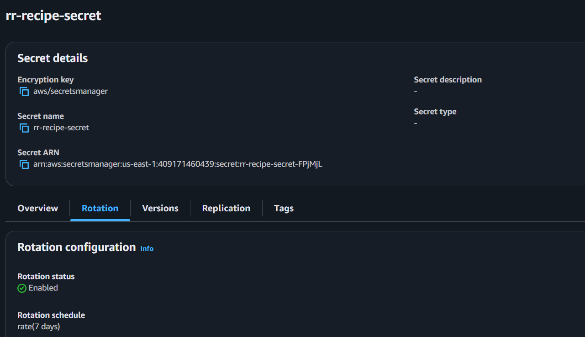

## Step 8

Another critical element of architecture is IAM Role. We will create an IAM Role for ECS Task so that they are able to connect to other AWS services on our behalf for instance they need to be able to talk to secrets manager and that role is going to be used by the ECS Task to have the necessary permissions to do all the stuff they need to do. We will also create another role for EC2 so we will deploy an EC2 instance that will act as the Docker server. We will deploy a Linux server on which we will install Docker and then we will create Docker images which will then be hosted on Elastic Container Registry. So we will use an EC2 role so that we can connect to the EC2 instance and give it permissions that it needs. 

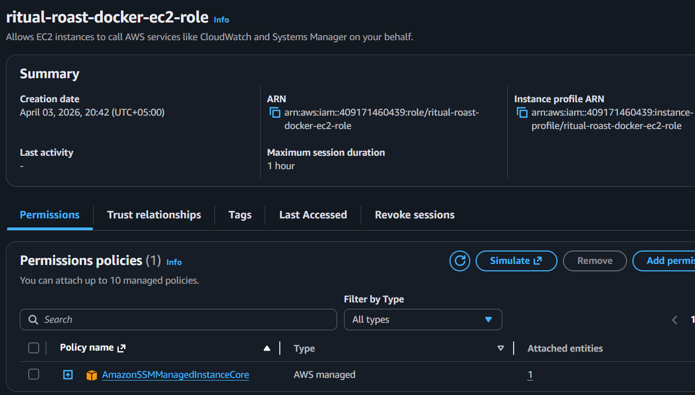

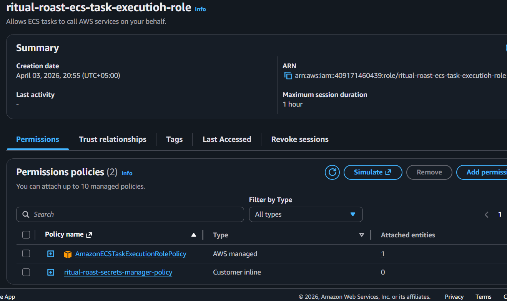

## Step 9

Next step, we will deploy an EC2 instance which will be used as Docker server. After deploying the instance, the kernel will also be upgraded and then Docker service will be installed. The EC2 instance will be deployed using Amazon Linux 2023 AMI in the public subnet. Once Docker is setup and images are created and hosted on ECR then the instance will be terminated. The commands executed in order to configure Docker server are shared below:

```
sudo yum update -y
sudo yum install docker -y
sudo service docker start
sudo usermod -aG docker ec2-user
```

Below is a screenshot of the created Docker server instance:

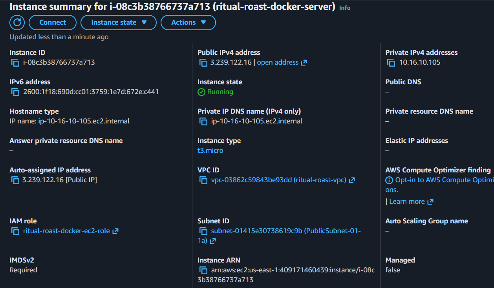

## Step 10

Before creating our Docker images using the Docker server we configured in previous step, we will create repositories in Amazon Elastic Container Registry service. This is the service that is used to host the container images and will then be deployed to ECS service to create the ECS instances. Below are screenshots of the two private repositories created:

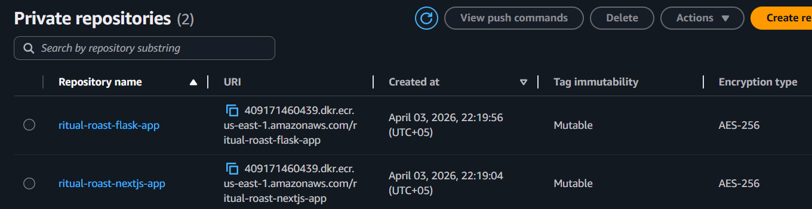

## Step 11

Next, we will create the Docker images and push those images to the ECR repositories we had created in the previous step. We will access the Docker server that we had configured in Step 9. The dockerfiles are provided in the Resources directory present in the Github repository. Using the dockerfiles we will create and push images from the Docker server to ECR. In order for Docker server EC2 instance to communicate with ECR we would also attach a permission policy called _EC2InstanceProfileForImageBuilderECRContainerBuild_ so that it can get authentication token and finally push images to ECR. The commands executed to pull the source code files from Github repository, then to create and push Docker images are shared below:

**To get the resource files from the github repository and extract the contents follow below steps:**
```
curl -L -o ritual-roast-flask-backend.zip https://github.com/asadjvd/AWS-Projects/tree/440c2a8abd96bffd9544730bf3a1a3ef4077f35e/Ritual-Roast-Containerized-Application/Resources
curl -L -o ritual-roast-nextjs-frontend.zip https://github.com/asadjvd/AWS-Projects/tree/440c2a8abd96bffd9544730bf3a1a3ef4077f35e/Ritual-Roast-Containerized-Application/Resources
unzip ritual-roast-flask-backend.zip
unzip ritual-roast-nextjs-frontend.zip
```

**Build and push Docker image for Nextjs Frontend Application**
```
cd ritual-roast-nextjs-frontend/
docker build -t <aws_account_id>.dkr.ecr.<region>.amazonaws.com/<repository-name> .
aws ecr get-login-password --region <region> | docker login --username AWS --password-stdin <aws_account_id>.dkr.ecr.<region>.amazonaws.com
docker push <ecr-repository-uri>:latest
```

**Build and push Docker image for Flask Backend Application**
```
cd ritual-roast-flask-backend/
docker build -t <aws_account_id>.dkr.ecr.<region>.amazonaws.com/<repository-name> .
aws ecr get-login-password --region <region> | docker login --username AWS --password-stdin <aws_account_id>.dkr.ecr.<region>.amazonaws.com
docker push <ecr-repository-uri>:latest
```

Below are screenshots of the new policy attached to EC2 role for ECR and Docker images created and pushed to the respective repositories in ECR:

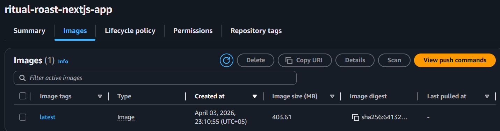


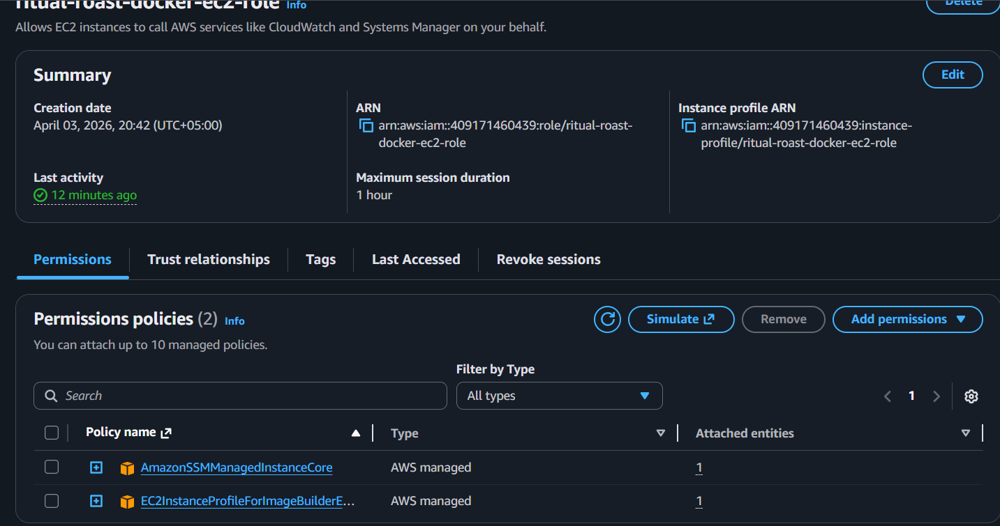

## Step 12

Next step is to deploy two target groups one for Flask backend application and the other for frontend nextjs application. The architecture is such that fargate would launch the containers within a fargate shared environment and then it would inject ENI cards into the VPC into the appropriate subnets it identified which means the target types would be IP addresses. Below is a screenshot of ECS target groups:

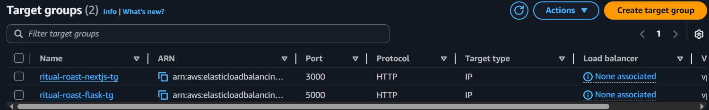

## Step 13

Next, we create the load balancer which we will configure to connect to the already created target groups. The load balancer deployed will forward traffic to Nextjs target group and we will also have to create to rule which is a path based rule so that we can send traffic destined for all of those API calls to the Flask backend target group. Load balancer would distribute any incoming traffic with a default route to frontend UI nextjs app but any traffic that is destined to the API calls to add recipes or get recipes should be directed to the Flask app so will have to create an additional rule in Load Balancer for path based routing to the flask target group. Below are screenshots of Application Load Balancer: 


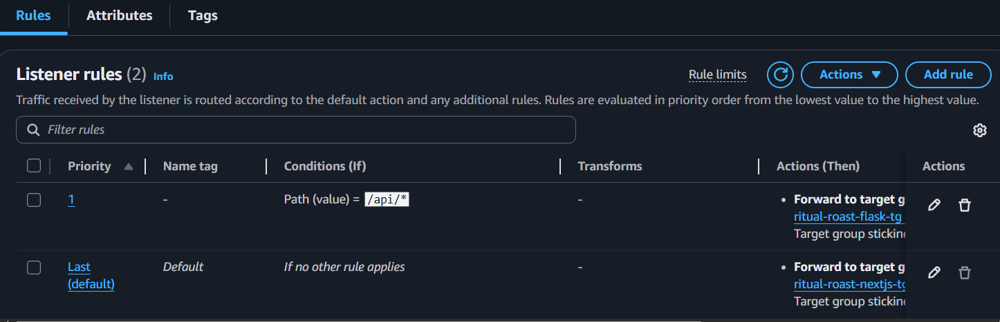

## Step 14

Next step is to deploy the Task Definitions that will describe what containers we are going to be deploying. Two task definitions will be created one for Flask based application and the other for nextjs application. The Task Definition has the blueprints of how we are going to deploy the containers, what is it the containers need to have interms of technology stack so it would have the link to the images to describe what image to deploy. It would also need IAM Roles in order to grant the permissions to ensure when the task is deployed its able to interact with the other AWS services in our application stack and also it will then be configured as this blueprint as this definition file that is going to subsequently be deployed into the ECS cluster. Task Definition describes what images we are going to be using for our containers which also has the necessary IAM Roles. Below is screenshot of the two Task Definitions created for frontend and backend applications:

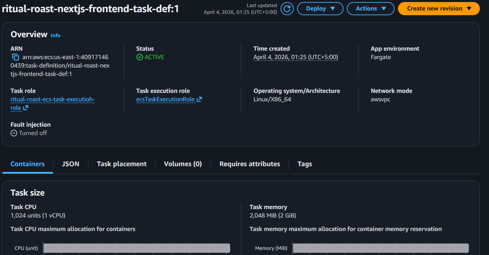

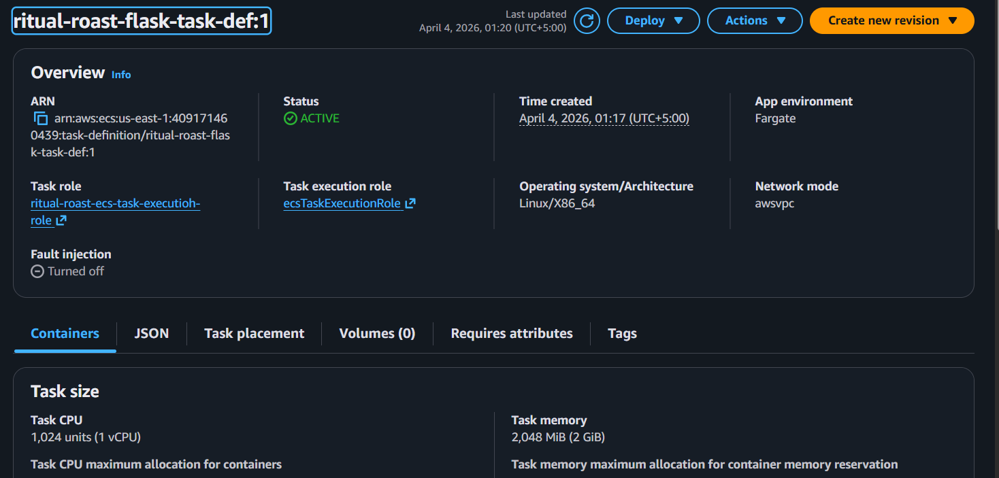

## Step 15

Next, we need to deploy an ECS cluster. ECS cluster is logical grouping of compute resources these could be EC2 instances or Fargate ENIs that are going to be injected into the VPC that connect back to the shared Fargate environment and they are used for containerized application. ECS cluster will essentially act as the boundary for the applications providing resource management, networking and security isolation. Before we can convert the Task Definitions to actual Tasks we need to deploy ECS cluster. ECS Cluster defines the network boundary within which we are going to deploy ECS tasks and incase of Fargate it is going to be injection of ENI network interfaces from a shared managed Fargate environment. We have got our ECS cluster deployed, we have got our task definitions, we have got our images in our ECR repository. We need to now deploy our ECS services. ECS services will trigger the launch of ECS Tasks in the Fargate environment which will inject those ENI into the VPC. From the Task Definition within the ECS cluster we have to create ECS Services. We will create one service for Nextjs and one for Flask. So the two services would go ahead and deploy the necessary containers based on our capacity requirements into the AWS Fargate task environment. Once the services are deployed then Fargate based on the network configuration and the definitions and the parameters of Task Definitions as well as Service configurations AWS Fargate would inject those ENI cards into the VPC into the Web/App Subnet and then the application will be accessible from there. Once done we can test the environment as website would be accessible. So now we have got two sets of services for the frontend next js app and two sets of services for the backend flask app across two availability zones to offer redundancy and high availability and then once that is in place traffic will able to flow from the load balancer into those relevant tasks based on the rules that we defined in the load balancer as to which target group to connect to depending on the type of traffic that is going in. So if its only accessing the website then its going to go to Next.js TG and if its posting or submitting recipes into the database then it is going to send that request to Flask TG which is going to connect to Flask Tasks which is then going to update the database. Finally, the backend application is going to be retrieving the database credentials from the Secrets Manager in order to make those calls to the database. Below are screenshots of ECS services:


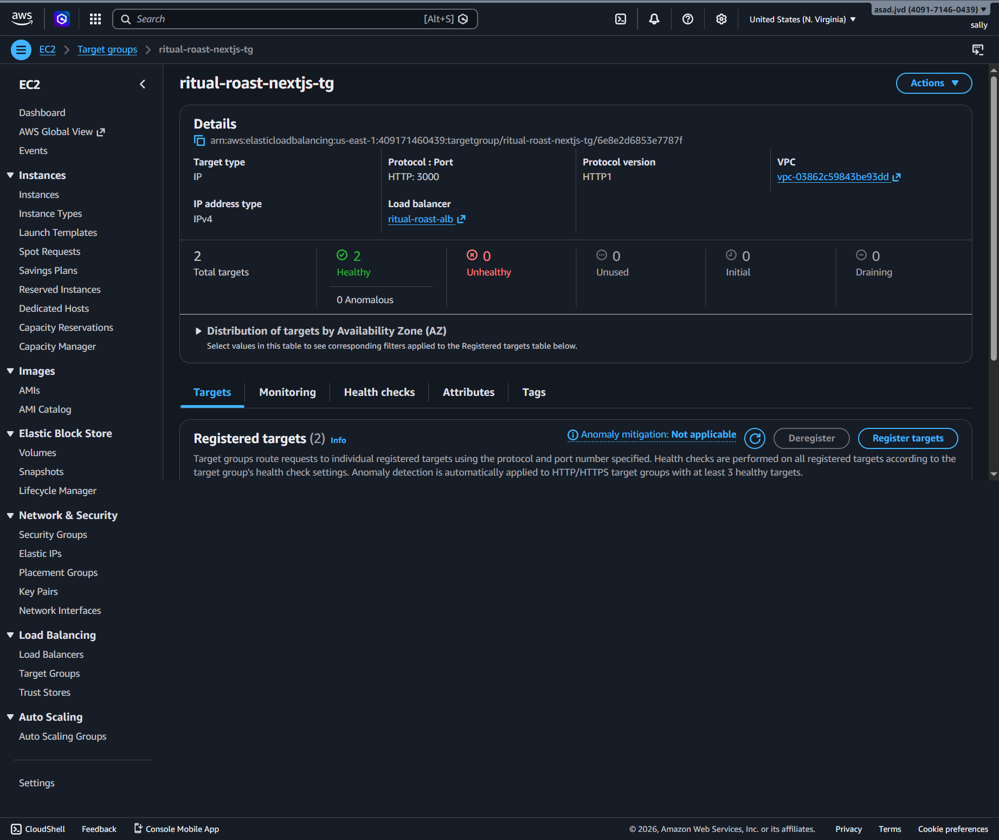

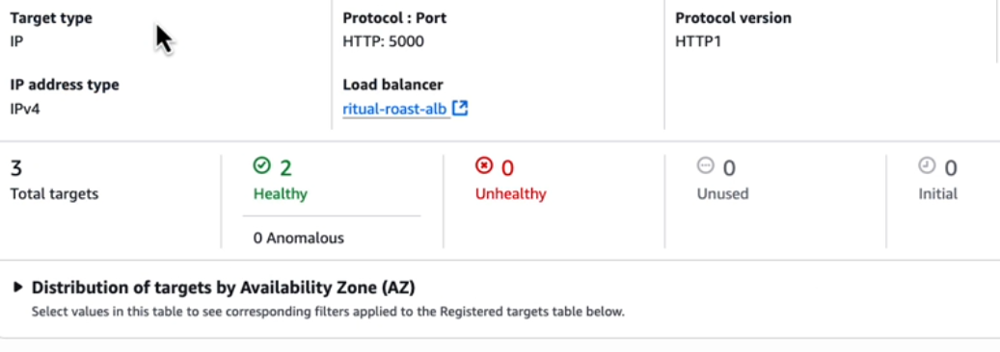

## Step 16

Finally, the users on the internet then will be able to access the application via the ALB. If they are accessing just the website then traffic is going to go through Nextjs TG and if they are making API calls then they would go through Flask TG and its going to go into those subnets connecting to those Fargate ENIs which are going to connect back into Tasks and we wiil have our application fully functional. 

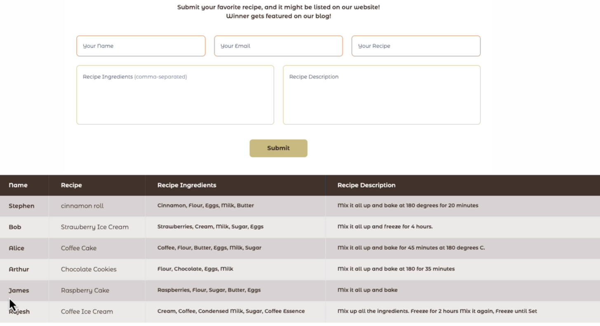

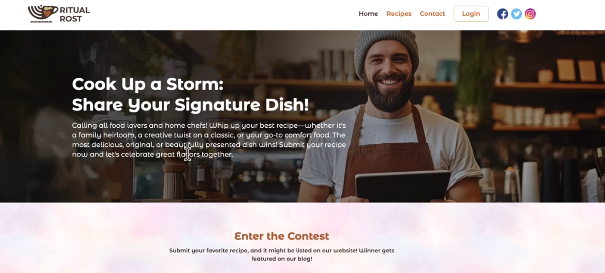
