# Serverless Application on AWS – Ritual Roast Recipe Contest

This project demonstrates a **serverless web application built on AWS** for the **Ritual Roast coffee shop**.
The application allows customers to **submit and share their favourite snack or beverage recipes** as part of a **Recipe Contest**, using a fully managed, scalable serverless architecture.

---

## Project Overview

The **Ritual Roast Recipe Contest App** enables customers to participate in an online competition by posting their favourite coffee-inspired drinks or snack recipes.

The application uses **Amazon S3 and Amazon CloudFront** to deliver a fast, secure static website, while backend services are implemented using a serverless-first approach to eliminate server management and scale automatically during peak contest activity.

**Key goals of this project:**

* Increase customer engagement through a recipe submission platform
* Deliver fast, global access to the web application
* Eliminate server management
* Automatically scale during high traffic periods
* Pay only for actual usage
* Follow AWS best practices for security and reliability

---

## Architecture

The application follows this high-level flow:

1. Customers access the Ritual Roast Recipe Contest website via Amazon CloudFront
2. Static web content (HTML, CSS, JavaScript) is served from Amazon S3
3. Client-side requests are sent to Amazon API Gateway
4. AWS Lambda processes recipe submissions and retrieval requests
5. Amazon DynamoDB stores customer recipes and contest entries
6. Responses are returned to the client application through the API

---

## AWS Services Used

* **Amazon S3** – Hosts the static web application
* **Amazon CloudFront** – Global content delivery with low latency and HTTPS
* **Amazon API Gateway** – Exposes APIs for submitting and viewing recipes
* **AWS Lambda** – Handles backend business logic for the recipe contest
* **Amazon DynamoDB** – Stores recipe submissions and contest data
* **AWS IAM** – Manages secure access and permissions
* **Amazon CloudWatch** – Logging, monitoring, and observability

---

## Customer Flow Chart
**Customer (Web Browser)** 
* Initiates access to the web app via public internet

**API Gateway**
* Accepts PUT and GET requests only
* Invokes appropriate Lambda function

**AWS Lambda**
* AppRecipe function adds recipe to DynamoDB Table
* GetRecipe function retrieves recipes from table
  
**AWS DynamoDB**
* Stores submitted recipe data
* NoSQL database with dynamic throughput provisioning

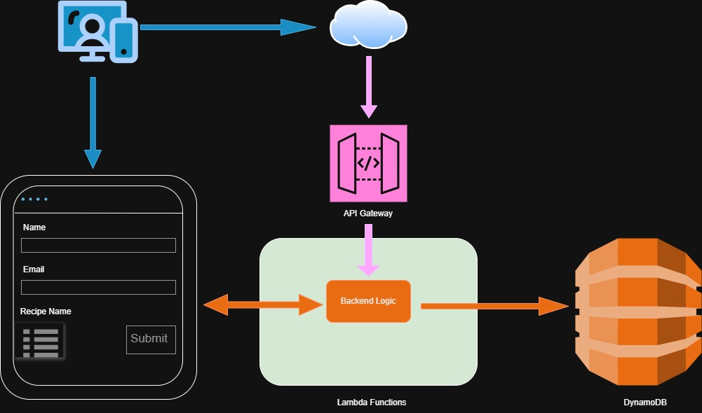

---

## Low Level Design Architecture

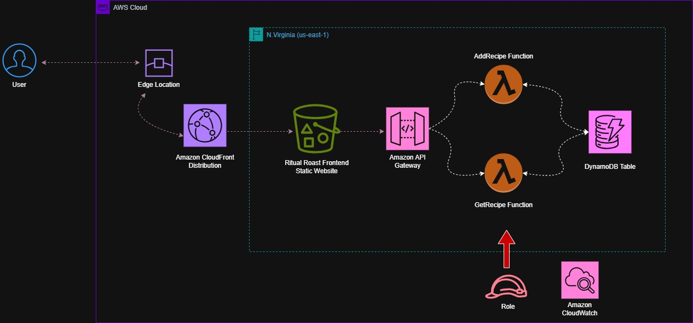

---

# Low Level Design Documentation

## DynamoDB Table

<table>
  <tr><th>Component</th><th>Details</th></tr>
  <tr><td>Table Name</td><td>recipes</td></tr>
  <tr><td>Primary (Partition) Key</td><td>ID (String)</td></tr>
  <tr><td>Capacity Mode</td><td>On Demand</td></tr>
</table>

## IAM Role

<table>
  <tr><th>Component</th><th>Details</th></tr>
  <tr><td>Role Name</td><td>ritual-roast-lambda_dynamodb_role</td></tr>
  <tr><td>Permissions 1</td><td>AWSLambdaBasicExecutionRole</td></tr>
  <tr><td>Permissions 2</td><td>AmazonDynamoDBFullAccess</td></tr>
</table>

## Lambda Functions

<table>
  <tr><th>Function 1</th><th>Details</th></tr>
  <tr><td>Function Name</td><td>AddRecipe</td></tr>
  <tr><td>Runtime</td><td>Python 3.14</td></tr>
  <tr><td>Architecture</td><td>x86_64</td></tr>
  <tr><td>Execution Role</td><td>ritual-roast-lambda_dynamodb_role</td></tr>
</table>

<table>
  <tr><th>Function 2</th><th>Details</th></tr>
  <tr><td>Function Name</td><td>GetRecipe</td></tr>
  <tr><td>Runtime</td><td>Python 3.14</td></tr>
  <tr><td>Architecture</td><td>x86_64</td></tr>
  <tr><td>Execution Role</td><td>ritual-roast-lambda_dynamodb_role</td></tr>
</table>

## API Gateway

<table>
  <tr><th>Component</th><th>Details</th></tr>
  <tr><td>API Type</td><td>REST API</td></tr>
  <tr><td>API Name</td><td>RecipeRestAPI</td></tr>
  <tr><td>Endpoint Type</td><td>Edge Optimized</td></tr>
  <tr><td>IP Address Type</td><td>IPv4</td></tr>
  <tr><td>Resource/Methods</td><td>POST and GET</td></tr>
  <tr><td>Integration Type</td><td>Lambda – AddRecipe Lambda – GetRecipe</td></tr>
  <tr><td>Stage</td><td>Prod</td></tr>
  <tr><td>CORS</td><td>Enable – Gateway Response 4xx and Access-Control-Allow-Methods: GET, OPTIONS, POST</td></tr>
</table>

## Amazon S3 Bucket

<table>
  <tr><th>Component</th><th>Details</th></tr>
  <tr><td>Amazon S3 Bucket</td><td>General Purpose</td></tr>
  <tr><td>Contents</td><td>HTML and related files</td></tr>
</table>

## CloudFront Distribution

<table>
  <tr><th>Component</th><th>Details</th></tr>
  <tr><td>Origin</td><td>S3 Bucket</td></tr>
  <tr><td>Enable OAC</td><td>Yes</td></tr>
  <tr><td>Enable WAF</td><td>Yes (not for lab)</td></tr>
  <tr><td>Supported HTTP Versions</td><td>HTTP/2</td></tr>
</table>

---

# Deployment Steps with Screenshots

## Step 1

* We will be creating an IAM Role that will have two sets of permissions one will be for Lambda basic execution and second for DynamoDB full access.

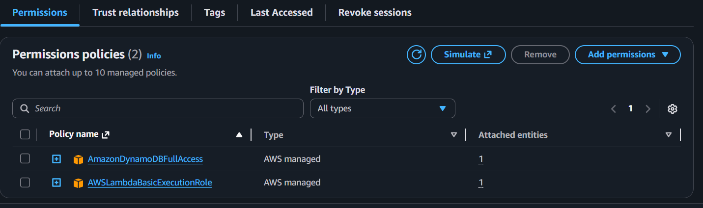

---

## Step 2

* Once we have IAM Role in place then we will deploy DynamoDB table.
* This is the table that will be used to host all of the customer recipes.
* The DynamoDB table will be created in the us-east-1 region and they are not deployed in a VPC which means we don't need a VPC.

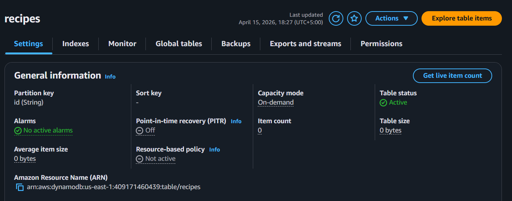

---

## Step 3

* Next, we will create the two Lambda functions called AddRecipe and GetRecipe.
* The purpose of the functions would be to add recipes in the database and also retrieve recipes from the database and have them published on the website.
* The Lambda functions will need to communicate with the DynamoDB table so they will need the necessary IAM Roles with permissions to access the table.
* In addition to that Lambda function will need access to CloudWatch to deliver log files and log information about the functions and so that will need to be incorporated in permission set for that IAM Role.

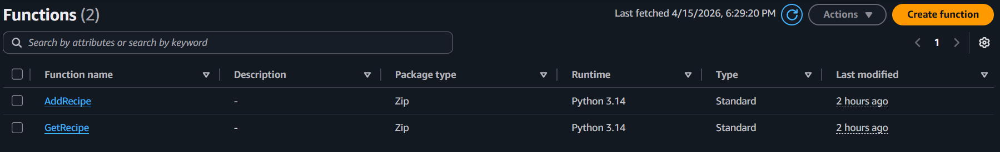

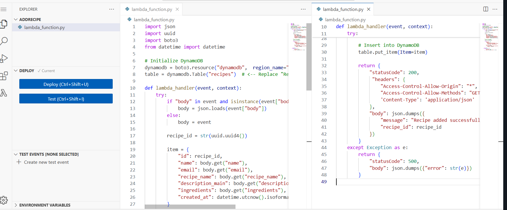

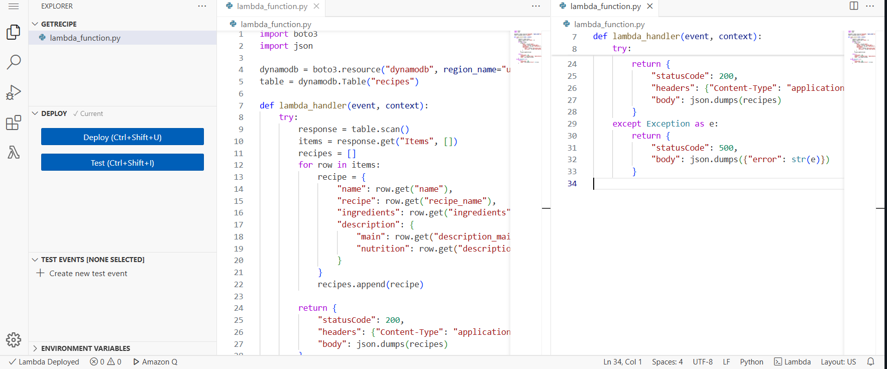

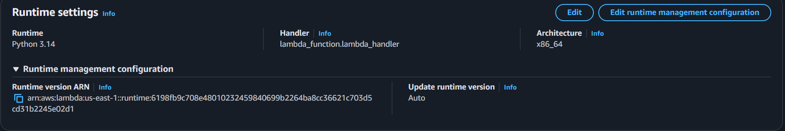

---

## Step 4

* Next, we are going to deploy API Gateway specifically we are going to be creating REST API and methods for posting and getting recipes from the database using the Lambda functions.
* So we are going to use the API Gateway to invoke the Lambda functions and then we will be able to work with the backend database.
* It will be configured with CORS and we will get an invokation URL that we will subsequently be able to use to invoke the Lambda functions.

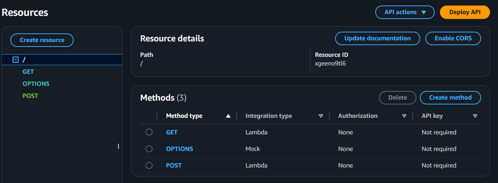

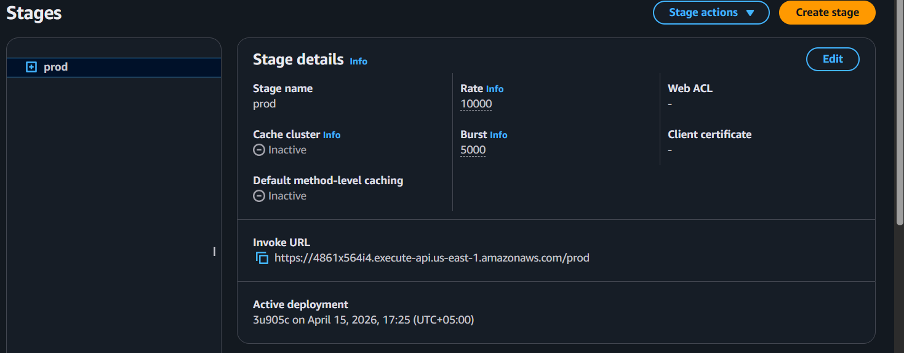

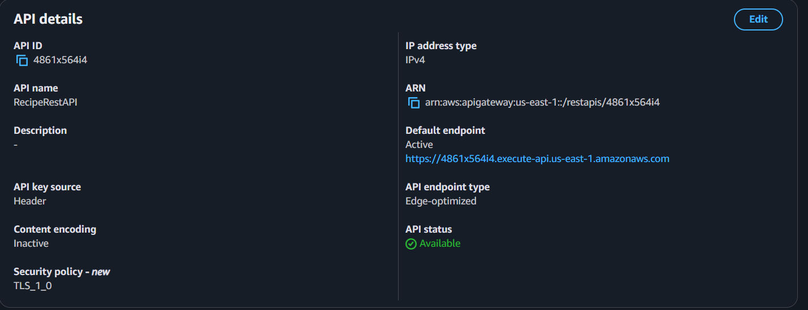

---

## Step 5

* In the next step we will deploy the S3 bucket that will be hosting the frontend application.
* The bucket will not be publicly accessible and only traffic from CloudFront Distribution will be allowed to reach S3 bucket.

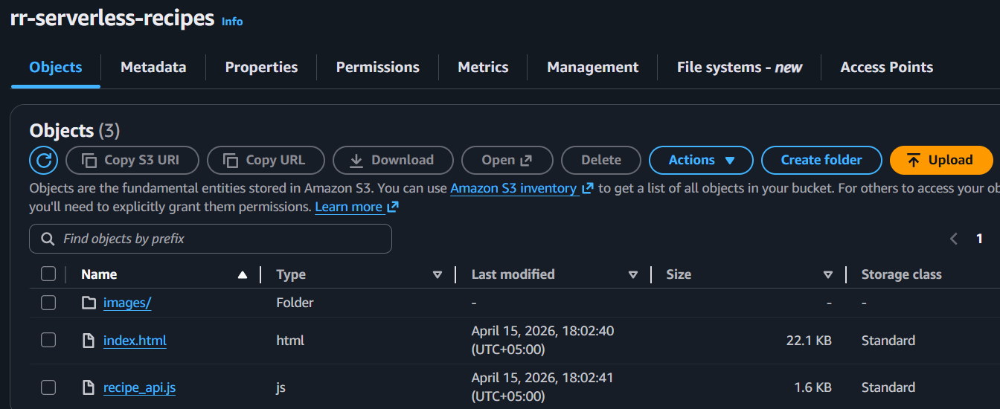

---

## Step 6 

* Finally, we will deploy CloudFront Distribution which will allow the user to access the website. It will be front-facing the S3 bucket.
* S3 bucket will be the origin for the CloudFront Distribution.

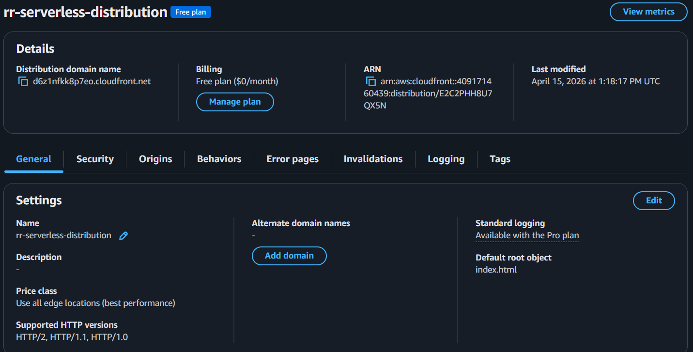

---

## Step 7

*  The web page was accessible using CloudFront URL https://d6z1nfkk8p7eo.cloudfront.net/
*  Recipes were also added to DynamoDB table as can be seen from screenshot.
*  The website is configured to reload upon every recipe submission so that the user can read the full list of available recipes that have already been submitted and made visible.
*  The user will always see the latest recipes that have been submitted along with the history of all the other recipes that are present in the public gallery page. 

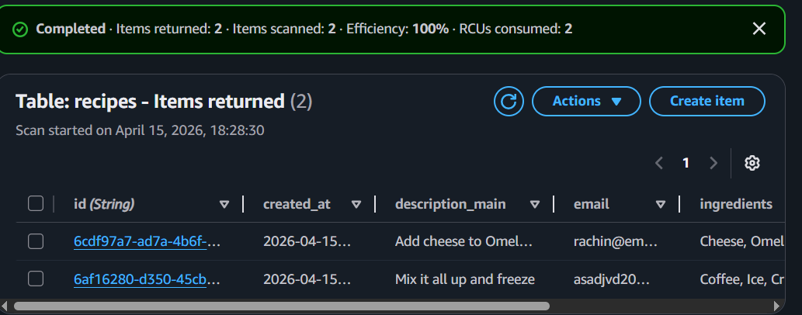

---
